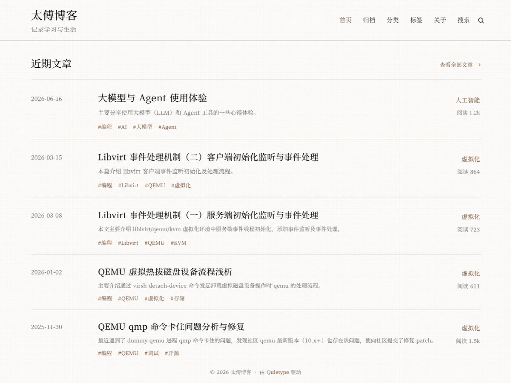

# Quietype

> A quiet WordPress theme for thoughtful reading.

Quietype 是一款面向中文长文与技术写作的经典 WordPress 主题。它以简约、素雅、明亮为设计基调，把排版、导航和交互集中在持续阅读这件事上，同时兼顾 Markdown 技术内容、移动端体验、访问性能与站点管理。



## 设计与能力

### 阅读体验

- 800px 长文阅读区与适合中英文混排的系统字体栈
- 纸白、米杏、浅绿三种亮色背景，选择仅保存在浏览器本地
- H2/H3 自动目录、章节永久链接、阅读进度和移动端折叠目录
- 克制的标题层级、段落节奏、分类标签、元信息与打印样式
- 固定移动 Header、抽屉导航、背景切换和返回顶部工具

### 技术内容

- Markdown 常见元素、KaTeX 公式、表格、脚注与多级列表
- 自有亮色代码配色、语言标记、行号、复制按钮和横向滚动
- 图片边框与图注、响应式媒体、懒加载及 PhotoSwipe 图片预览
- 长链接、行内代码和中英文长标识符的细粒度换行处理

### 站点页面与管理

- 首页、文章、分类、标签、搜索、年度归档、友链、关于与 404
- “但是还有书籍”年度阅读清单，支持分类、标签、短评、评分与豆瓣资料预览
- 浏览量、评论验证、文章版权声明和友链状态管理
- 轻量 SEO、SMTP 通知、自定义登录入口与 WordPress 常用优化
- 键盘焦点、`prefers-reduced-motion` 和基础无障碍支持
- 不写入主题私有短代码，切换主题不会锁定正文内容

## 环境要求与安装

- WordPress 6.4+
- PHP 8.0+

推荐从 [GitHub Releases](https://github.com/taifuer/quietype/releases) 下载 `quietype-<版本号>.zip`，在 WordPress 后台进入“外观 → 主题 → 安装主题 → 上传主题”完成安装。发布包已经包含顶层 `quietype/` 目录。

也可以直接克隆到主题目录：

```bash
cd wp-content/themes
git clone git@github.com:taifuer/quietype.git
```

启用后，WordPress 使用的主题目录标识为 `quietype`。

## 主题配置

### 设置入口

Quietype 自有选项集中在“外观 → Quietype 设置”，包括站点与页脚、文章版权声明、SEO、访问、WordPress 优化、登录安全、SMTP 通知和自定义代码。站点标题、菜单和额外 CSS 继续使用 WordPress 原生界面；旧版本保存在 Customizer 中的 Quietype 设置会自动迁移。

统计脚本、站点验证代码等可分别写入 Head 或 Footer。设置页使用 WordPress 自带代码编辑器，只有具备 `unfiltered_html` 权限的管理员可以保存可执行代码；样式仍建议使用“外观 → 自定义 → 额外 CSS”。

### 菜单与页面模板

主题提供两个菜单位置：

- `primary`：顶部主导航
- `prefooter`：正文之后、Footer 之前的页尾上方导航；未分配菜单时不输出

页尾上方导航使用单独的细线与居中链接呈现，不属于 Footer。Footer 仍只保留版权、联系方式与备案信息。

内置页面模板：

- `template-archives.php`：年度文章归档与标签汇总
- `template-links.php`：友情链接
- `archive-book.php`：按阅读年份分组的书籍清单
- `list-archive.php`：兼容旧归档模板
- `list-tag.php`：兼容旧标签模板；标签入口已整合进文章归档

普通页面、分类、标签、搜索和 404 按 WordPress 模板层级自动匹配。

### 阅读背景

背景选择保存在浏览器 `localStorage` 的 `quietype-reading-bg` 中，不写 Cookie 或数据库：

- `paper`：纸白
- `warm`：米杏
- `green`：浅绿

Quietype 目前只提供亮色阅读背景。

### 友链状态

主题启用期间会恢复 WordPress 原生“链接”管理入口，并提供友链状态、分组顺序和可达性检测。前台按照后台创建的链接分类动态分组，空分类不显示；“链接分类”中的数字顺序越小越靠前，留空时按名称排列，主题不写死站点专属分类。

每天可轮换检测至多五条可见友链。连续失败三次只进入后台“待确认”，不会自动在前台标记失联；管理员确认后才显示低调角标，恢复为“正常”即可移除。检测结果保存在 WordPress Options 中，不修改核心链接表。

### 书籍与阅读

后台“阅读”使用 WordPress 原生内容类型保存个人书目，分类与标签均由管理员创建。每条记录包含标题、作者、出版社、出版年份、ISBN、阅读月份、阅读状态、豆瓣评分、个人整星评价和一段简短点评。封面可使用特色图，也可填写 `pic.taifua.com` 等 HTTPS 图片地址；外链优先展示，加载失败时回退到文字封面。编辑页默认显示原生点评字段，列表以“状态 · 月份”集中呈现阅读记录，不把点评塞进快速编辑。公开总览位于 `/books/`，按阅读年份分组、月份倒序呈现；旧 `/reading/` 地址会永久跳转到新书架。阅读状态、月份、个人星级和豆瓣评分集中在点评上方，封面仅作展示，标题直接链接到豆瓣。书籍不另设本站详情页，详细阅读总结仍适合写成普通博客文章。

书籍编辑页接受豆瓣读书链接或条目 ID。点击“读取豆瓣资料”只生成标题、作者、出版社、出版年份、ISBN、评分和封面的预览，不会修改现有字段；核对后还需要点击独立的“确认填入”按钮。浏览器因豆瓣防盗链无法直接显示预览时，主题仍会保留已确认的封面地址，并在保存时由服务器经过来源、格式和大小校验后尝试导入媒体库；抓取、导入或前台加载失败时自动回退到文字封面。豆瓣页面结构或访问策略变化时，所有字段仍可手工填写。

## 内容渲染与代码呈现

主题通过标准 `the_content` 渲染文章，不修改编辑器保存的 Markdown 原文。WP Editor.md、KaTeX 和 Prism 都不是运行主题的强制依赖；使用 WP Editor.md 时，Markdown 仍保存在 `post_content_filtered`，Quietype 只处理最终前台输出。

文章目录根据渲染后的 H2/H3 自动生成，章节锚点不会写回数据库。存在 Prism 时，它只负责语法解析、语言标记与行号；代码块的亮色 token 配色、语言标签和中文复制按钮由 Quietype 提供，不依赖远程代码样式或 ClipboardJS CDN。

Quietype 会检查当前正文，只在确实存在代码、公式、图表或图片时保留相关资源；普通页面和纯文本文章不会加载整套编辑器前端依赖。

## SEO

未检测到 Yoast SEO、Rank Math、All in One SEO、SEOPress 或 The SEO Framework 时，Quietype 输出轻量的 description、keywords、Open Graph、社交摘要和 Schema.org JSON-LD；启用专用 SEO 插件后会停止输出整组元数据，避免重复。

文章描述按“自定义描述 → 手工摘要 → 自动摘要”取值，关键词按“自定义关键词 → 标签 → 分类 → 站点关键词”取值，社交图片按“特色图 → 第一张正文图片 → 默认分享图”取值。文章与页面编辑页中的“Quietype SEO”区域可以覆盖自动结果。

`meta keywords` 对主流搜索引擎作用有限，仅作为兼容字段保留；规范标题、描述、结构化数据和可读内容更重要。

## 访问优化

主题不加载网络字体，PhotoSwipe 随主题本地分发，正文相关资源按内容条件保留。图片支持原生懒加载、远程尺寸缓存和替代文字发布检查，减少布局偏移与无效请求。

评论头像默认将 WordPress 生成的 Gravatar 地址替换为 `https://gravatar.loli.net/avatar/`。可在“外观 → Quietype 设置 → 访问”中修改，留空则使用 WordPress 原始地址；开发者也可以通过过滤器覆盖：

```php
add_filter( 'quietype_avatar_base_url', function () {
	return 'https://secure.gravatar.com/avatar/';
} );
```

## 登录、评论与安全

Quietype 重设登录、找回密码和密码重置页面的视觉样式，并可启用自定义入口参数、一次性算术验证码和 XML-RPC 认证保护。参数名为 `entry`、参数值为至少 24 位私有随机字符串时，初始入口形如 `wp-login.php?entry=<私有值>`；校验成功后会换取 12 小时、HttpOnly、SameSite 的签名 Cookie，并跳转到不含入口值的地址。

入口保护启用后，默认入口、错误参数和未登录的 `/wp-admin/` 返回 404。启用前请保存完整入口地址，不要把真实值写入仓库、截图或统计平台。需要文件级配置时，可在 `wp-config.php` 定义 `QUIETYPE_LOGIN_GATE_KEY` 和 `QUIETYPE_LOGIN_GATE_VALUE`，常量优先于后台字段。

公开评论使用十分钟有效、提交后立即作废的四位数字验证，并配有蜜罐和短时提交节流。隐藏入口和简单验证码用于减少自动扫描与垃圾提交，不能替代强密码、双重验证和服务器限速；切换主题会恢复 WordPress 默认登录行为。

## SMTP 与通知

“外观 → Quietype 设置 → 邮件”可以让 WordPress 内置 `wp_mail()` 使用 SMTP，并发送测试邮件。支持 TLS、SMTPS、无加密连接、可选身份验证、自定义发件地址，以及管理员登录和新评论通知。Quietype 通知使用无外部资源的响应式 HTML 模板。

SMTP 密码以原值保存在 WordPress 数据库中，建议使用邮箱服务商提供的独立授权码；也可以在 `wp-config.php` 定义 `QUIETYPE_SMTP_PASSWORD`。正式使用前还应配置 SPF、DKIM 与 DMARC，并通过测试邮件确认投递。

## WordPress 优化

“外观 → Quietype 设置 → WordPress”可以隐藏登录用户在前台看到的管理工具栏，并停止为文章和页面创建新的历史版本；后台工具栏和自动保存不受影响。已有历史版本不会被静默删除，需要管理员核对数量后单独确认。

## 开发与自动化回归

主题没有前端构建步骤。修改 PHP、CSS 或 JavaScript 后可以直接在本地 WordPress 中预览。仓库提供独立于真实博客数据的自动化回归环境，运行它需要 Node.js 22、Docker Compose 和 Chromium 所需系统依赖。

- 根目录 PHP 文件：WordPress 模板和主题功能
- `template-parts/`：文章列表组件
- `assets/js/`：主题交互与图片预览
- `assets/vendor/`：随主题分发的第三方依赖及许可证
- `inc/books.php`：阅读数据、豆瓣资料预览、封面导入和年度排序
- `style.css`：主题声明与前台样式
- `theme.json`：编辑器基础设置
- `screenshot.png`：README 与 WordPress 后台主题预览图
- `tests/`：固定种子内容、浏览器测试和桌面/移动视觉基线
- `.github/workflows/quality.yml`：PHP 兼容性与浏览器质量门禁

首次运行：

```bash
npm ci
npx playwright install --with-deps chromium
npm run env:start
npm run env:seed
npm run test:e2e
npm run test:performance
npm run env:stop
```

测试站默认使用 `http://localhost:8888`，停止时会删除测试 WordPress 与数据库卷，不读取真实博客。Playwright 覆盖首页、文章、归档、友链、关于、搜索和 404，并检查控制台错误、关键交互、HTML 结构、axe 严重无障碍问题及 390px/1440px 视觉基线。Lighthouse 检查首页与代表文章的性能、无障碍、最佳实践、SEO 和资源体积预算。

只有确认视觉变化符合预期时才更新基线：

```bash
npm run test:e2e:update
```

失败截图、trace、HTML 报告和 Lighthouse 报告输出到 `artifacts/`，GitHub Actions 保留这些文件 14 天。

## 许可证

Quietype 基于 [GNU General Public License v2 or later](LICENSE.txt) 发布。主题内置 PhotoSwipe 5.4.4，并依据其 [MIT License](assets/vendor/photoswipe/LICENSE) 分发。
