# Quietype

> A quiet WordPress theme for thoughtful reading.

Quietype 是一款面向中文长文与技术写作的经典 WordPress 主题。它以简约、素雅、明亮为设计基调，把排版、导航和交互集中在持续阅读这件事上，同时兼顾 Markdown 技术内容、移动端体验、访问性能与站点管理。

[在线演示](https://taifua.com/) · [版本发布](https://github.com/taifuer/quietype/releases) · [更新记录](CHANGELOG.md)

## 页面预览

| 首页 | 关于 |
| --- | --- |
| 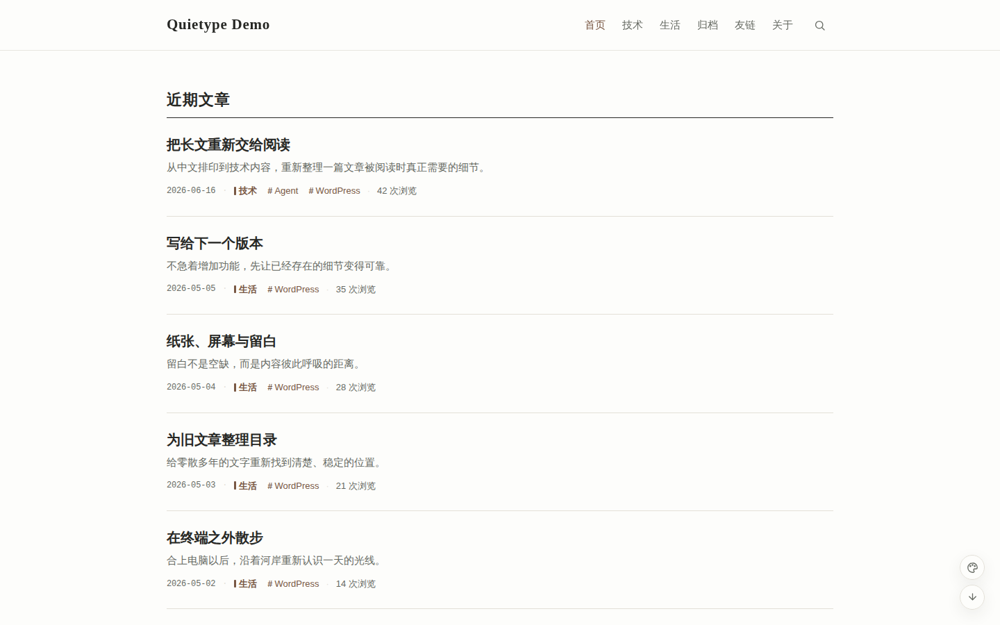 | 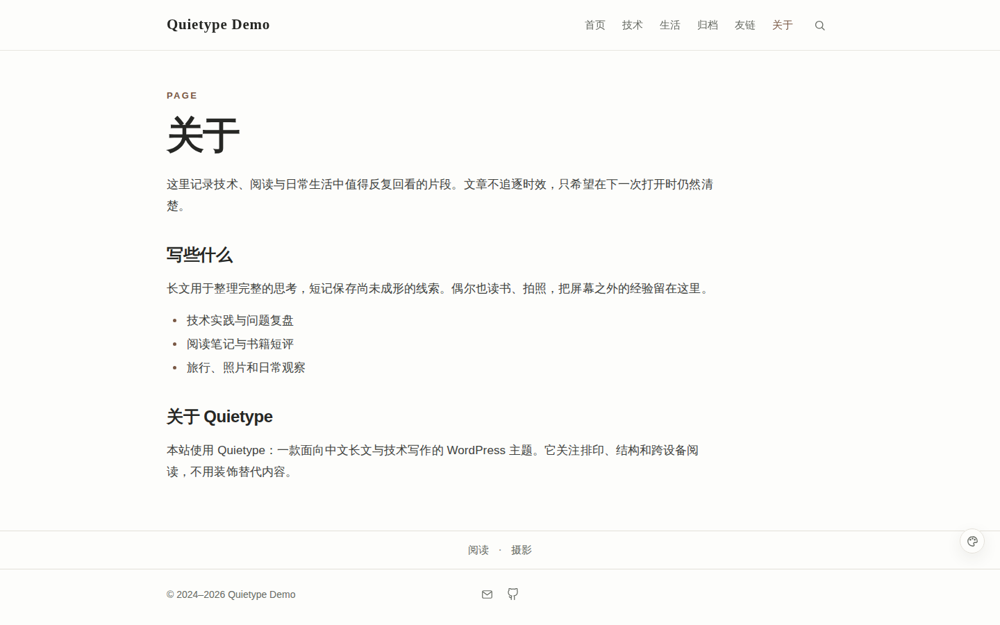 |

| 文章排版 | 代码与公式 |
| --- | --- |
| 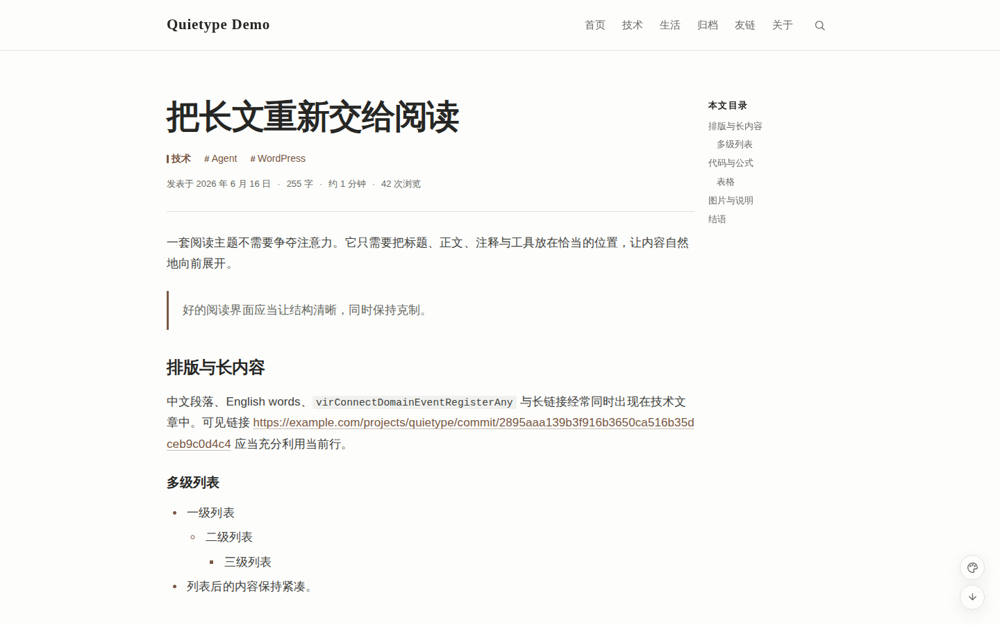 | 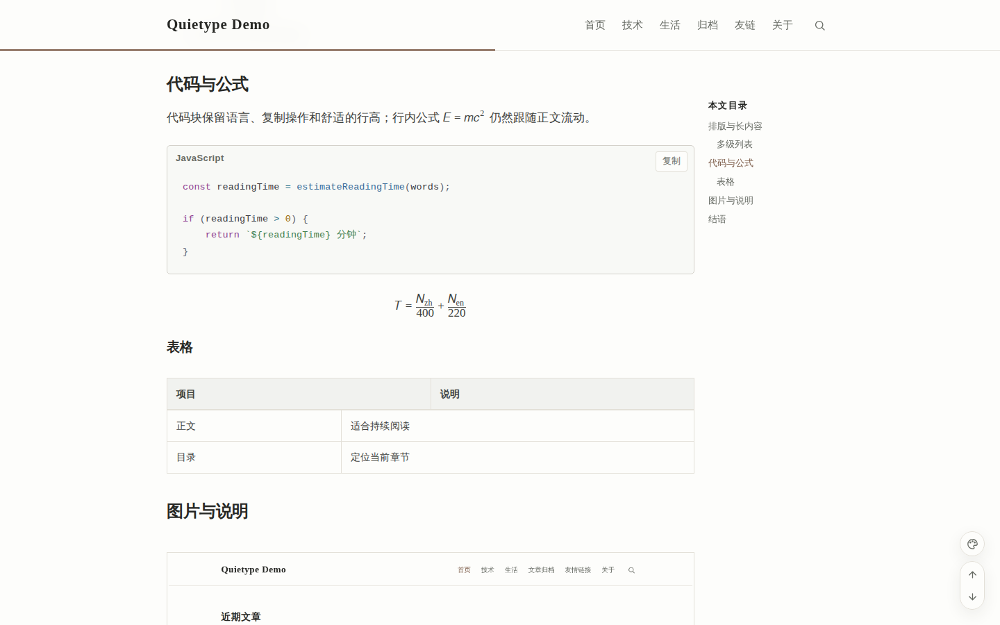 |

| 年度书架 | 年度照片 |
| --- | --- |
| 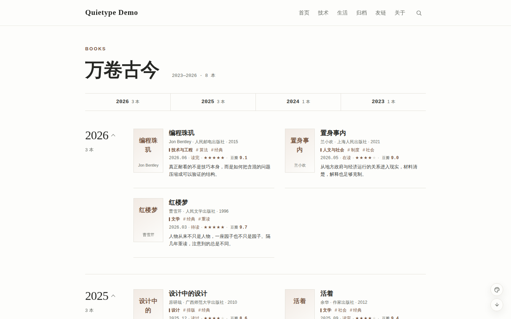 | 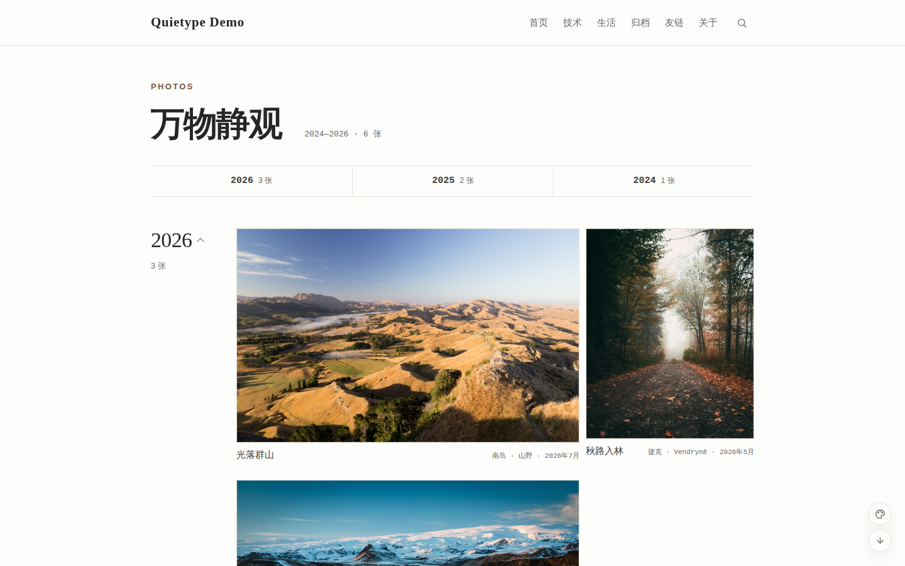 |

| 文章归档 | 友情链接 |
| --- | --- |
| 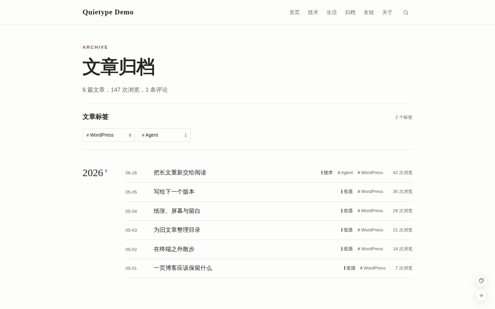 | 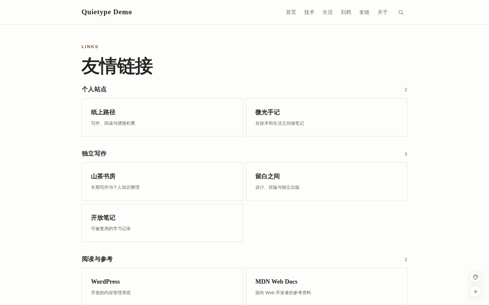 |

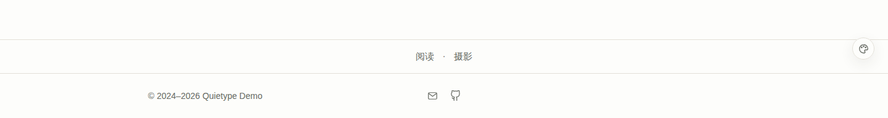

<details>
<summary>查看移动端页面</summary>

| 首页 | 文章 |
| --- | --- |
| 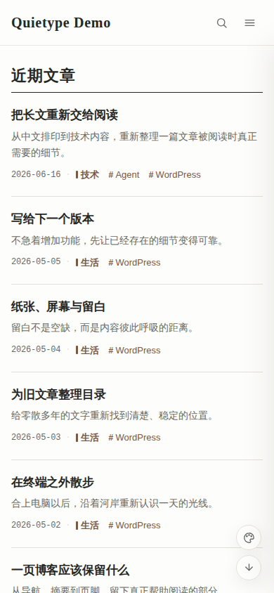 | 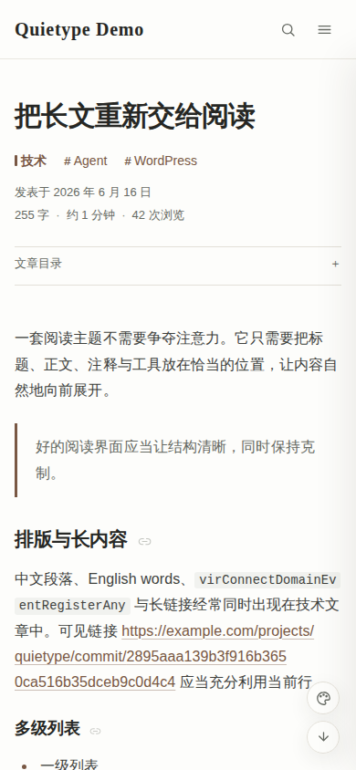 |

</details>

演示图由隔离测试环境和固定内容生成，不依赖线上文章、私人书目或个人照片；图库素材的来源与许可记录在[演示照片来源](tests/fixtures/photos/README.md)。

## 设计原则

- **阅读优先**：800px 长文区、克制的标题层级和适合中英文混排的系统字体栈。
- **安静但不简陋**：纸白、米杏、浅绿三种亮色阅读背景，保留必要反馈而减少视觉噪音。
- **技术写作友好**：支持常见 Markdown 结构、KaTeX、Prism、表格、脚注、多级列表和长标识符换行。
- **保持轻量**：不加载网络字体，图片预览组件本地分发，代码、公式和图库资源按内容加载。

## 主要能力

### 阅读与交互

- H2/H3 自动目录、章节永久链接、阅读进度和移动端折叠目录
- 固定移动 Header、抽屉导航、搜索、背景切换与返回顶部工具
- 亮色代码配色、语言标记、行号、复制按钮和键盘可访问的横向滚动
- 响应式图片、图注、打印样式及 PhotoSwipe 图片预览
- 首页、文章、分类、标签、搜索、年度归档、友链、关于与 404 模板

### 内容与管理

- `/books/` 年度书架：分类、标签、短评、阅读状态、评分及可选资料链接
- `/photos/` 轻量图库：外链图片、缩略图、拍摄信息、年度折叠及原图入口
- 可配置文章版权声明、浏览量、友链状态、SMTP、轻量 SEO 与隐私说明
- 自定义登录入口、评论验证及面向单作者站点的 WordPress 常用优化
- 不写入主题私有短代码；普通文章正文不会因切换主题而锁定

## 环境与安装

- WordPress 6.6+
- PHP 8.0+

推荐从 [GitHub Releases](https://github.com/taifuer/quietype/releases) 下载 `quietype-<版本号>.zip`，然后在 WordPress 后台进入“外观 → 主题 → 安装主题 → 上传主题”。发布包已经包含顶层 `quietype/` 目录。

也可以直接安装开发版本：

```bash
cd wp-content/themes
git clone https://github.com/taifuer/quietype.git
```

启用后建议依次完成：

1. 在“外观 → 菜单”分配顶部主导航；需要时再分配正文之后的页尾上方导航。
2. 创建 `/archive/` 页面并指定“文章归档”模板；友链页指定“友情链接”模板。
3. 在“外观 → Quietype 设置”配置站点信息、内容页面、SEO、访问、安全和邮件。
4. 访问“设置 → 固定链接”并保存一次，使 `/books/` 与 `/photos/` 路由生效。

完整字段、缓存、登录保护、SMTP、书籍和照片配置见 [配置指南](docs/CONFIGURATION.md)。

## 内容与数据

Quietype 使用 WordPress 数据库存储书籍、照片、浏览量和主题选项。切换主题不会删除这些数据或普通文章正文，但书籍、照片的管理入口与归档路由会暂停注册，重新启用后恢复。集成内容类型使用 `book`、`photo`、`book_category` 和 `book_tag` 标识，安装注册同名类型的插件前请先检查冲突。

主题没有遥测或广告脚本。启用头像镜像、友链检测、SMTP、远程图片或自定义统计后，站点可能产生相应的外部请求；请在隐私政策中据实说明。部署或迁移前始终备份数据库与 `wp-content/uploads`。

## 开发与质量

主题没有前端构建步骤。自动化回归需要 Node.js 22.22+ 与 Docker Compose；仓库提供隔离的 WordPress、固定测试内容、Playwright、axe、视觉回归和 Lighthouse 预算：

```bash
npm ci
npm run env:start
npm run env:seed
npm run test:e2e
npm run test:performance
npm run env:stop
```

PHP 安全基线与静态检查：

```bash
composer install
composer lint -- --warning-severity=0
find . -name '*.php' -not -path './node_modules/*' -print0 | xargs -0 -n1 php -l
npm run test:js
git diff --check
```

GitHub Actions 在 PHP 8.0、8.2、8.4 以及 WordPress 6.6、6.8 上执行检查。推送 `v*` Tag 前，版本号必须同时匹配 `style.css`、`package.json` 和 `CHANGELOG.md`；通过后发布工作流会生成可安装 ZIP 与 SHA-256 校验文件。

## 参与与安全

- 贡献流程与代码约定：[CONTRIBUTING.md](CONTRIBUTING.md)
- 安全问题与私密报告方式：[SECURITY.md](SECURITY.md)
- 版本变化与迁移说明：[CHANGELOG.md](CHANGELOG.md)

## 许可证

Quietype 基于 [GNU General Public License v2 or later](LICENSE.txt) 发布。主题内置 PhotoSwipe 5.4.4，并依据其 [MIT License](assets/vendor/photoswipe/LICENSE) 分发。
