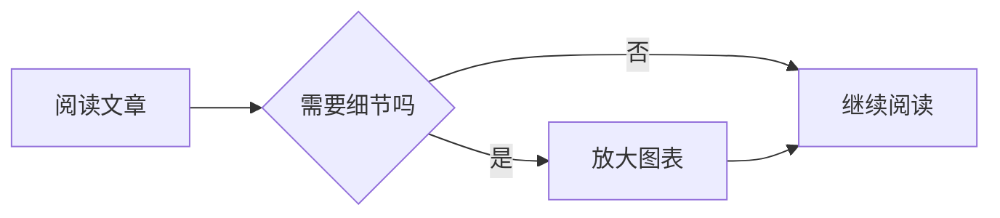

# 技术内容与阅读交互

Quietype 只增强前台 HTML，不改写已保存的正文或 Markdown 原文。图表和提示块仍是标准 Markdown 写法，不需要主题短代码。

## 目录与宽内容

使用 H2/H3 建立章节层级即可生成目录。桌面目录长标题单行省略，悬停或键盘聚焦显示全文；滚动正文时，当前章节会在目录自己的滚动区内跟随。手机和窄屏保留正文前的原生折叠目录，滑过它后，右侧工具区出现目录按钮，点击可定位其他章节。

普通表格的表头、表身共享列宽；确实过宽的表格可以在容器内滚动，键盘用户可以聚焦后用方向键操作。代码同样默认横向滚动，仅超宽代码出现“换行”按钮。换行只改变显示，不改变复制内容；Prism 行号会跟随调整。

## Mermaid 图表

在支持 Markdown 的编辑器中填写：

````markdown

````

也可以使用 `sequenceDiagram`、`classDiagram` 等 Mermaid 语法。原生 WordPress 不解析 Markdown 围栏：区块编辑器请使用自定义 HTML 块中的 `<pre class="mermaid">…</pre>`，或使用能输出 `code.language-mermaid` 的 Markdown 编辑器。HTML 块内的 `<`、`>`、`&` 需按 HTML 规则转义。

- 主题设置的 Mermaid 开关默认开启。WP Editor.md 的前台旧渲染器会被停用，编辑器预览不受影响。
- 只有含图表的文章/页面加载入口脚本；完整 Mermaid 库在图表距视口约 600px 时从本站加载，不依赖运行时公共 CDN。
- 图表使用纸白、米杏、浅绿对应的亮色配色。“放大查看”优先保留可读字号，宽图可滚动查看；“适应屏幕”可以查看全图，另有缩放按钮。按 Esc 或关闭按钮返回正文。
- 每张图保留可展开的源码；下载失败或语法错误时直接显示源码，其余正文与图表继续工作。关闭 JavaScript 时也保留服务端输出的源码。
- 使用固定 `strict` 安全级别；正文内配置不能放宽安全边界。HTML 交互和点击回调禁用，单图最多 50,000 字符、500 条边。大型架构图宜拆为多张，避免难读和长时间布局计算。
- 官方完整浏览器包约 3.6 MB（未压缩传输前），并非零成本组件。部署时应为 JavaScript 开启 gzip/Brotli；不含图表的页面不会请求该库。

语法、可访问性描述与配置参考 [Mermaid 官方文档](https://mermaid.js.org/config/usage.html)。可以在图中提供 `accTitle` / `accDescr` 为读屏软件补充信息。

## 提示块

主题识别以 `[!NOTE]`、`[!TIP]`、`[!IMPORTANT]`、`[!WARNING]`、`[!CAUTION]` 开始的引用块，分别显示“说明、提示、重要、注意、警告”：

```markdown
> [!NOTE]
> 这是与当前论述相关的补充说明。
```

普通引用不变。不建议连续堆叠提示块；经典 Markdown 解析器可能合并相邻引用，确需分开时在两块之间插入独立一行的 `<!-- -->`。

## 回归验证

先运行无插件的常规回归与 Lighthouse，再执行 `npm run env:plugins`、`npm run test:integration`。后者只在一次性的本地容器中安装固定版本 WP Editor.md，使用真实解析器生成测试文章；不使用线上数据，也不会修改生产站点。

测试覆盖两种视口、表格对齐、Prism 自动加载/行号/复制、KaTeX、目录截断/跟随/跳转、图表缩放/换色、无网络回退、恶意标签与可访问性。结束后使用 `npm run env:stop` 清理隔离容器。
