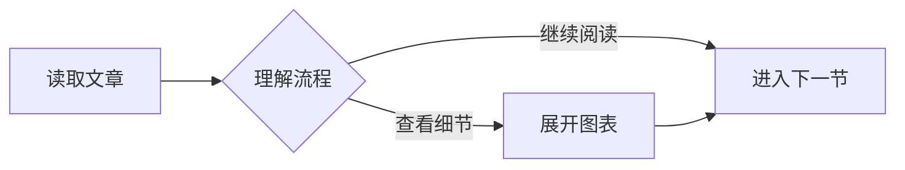
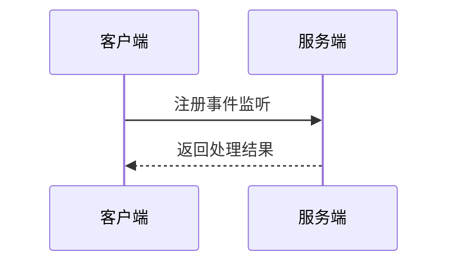
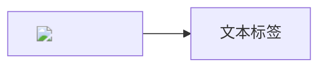

正文同时包含真实 Markdown 图表、数学公式、代码和宽表格，用于核验编辑器与主题共同工作时的阅读体验。

## 流程与时序





## 公式与表格

行内公式 $E = mc^2$ 与中文自然混排。下面是条件概率：

$$
P(A|B) = \frac{P(B|A)P(A)}{P(B)}
$$

| 参数传递 | 出栈方 | 名字修饰 |
| --- | --- | --- |
| 从右至左的顺序压参数入栈 | 函数调用方 | 直接在函数名称前加一个下划线 |
| 原生表格共享列宽 | 表头对齐 | 屏幕变窄时依然对齐 |

<table style="min-width: 900px"><thead><tr><th>字段</th><th>说明</th><th>调用过程</th></tr></thead><tbody><tr><td>callback</td><td>回调处理函数</td><td>接收请求、校验参数、执行回调并返回结果</td></tr></tbody></table>

## 提示与代码

> [!NOTE]
> 这是补充说明。阅读顺序与原始 Markdown 保持一致。

<!-- Separate adjacent blockquotes in classic Markdown. -->

> [!TIP]
> 宽代码可以使用右上角的换行按钮，复制内容不受影响。

<!-- -->

> [!WARNING]
> 修改服务配置之前，应确认适用环境。

<!-- -->

> 普通引用依然保持原有样式。

```javascript
const request = { endpoint: 'https://example.com/projects/quietype/events/callbacks', description: '长代码应当可以独立滚动，也允许读者按需要开启换行，而不会撑开整篇文章的宽度。' };
function handleEvent(event) {
  return { request, received: event.type, status: 'success' };
}
```

## 图表失败时保留源码

```mermaid
flowchart INVALID-DIRECTION
  A[这里故意放置错误语法]
```

## 图表文本安全



<pre><code class="language-mermaid">graph LR
  A[标准围栏输出] --&gt; B[兼容主题渲染]</code></pre>
